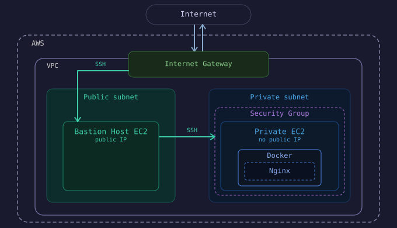

# AWS VPC + Bastion Host

Provisions a secure AWS network with a bastion host for SSH access and a private EC2 instance running Nginx in Docker. All infrastructure is managed with Terraform.

## Architecture



## Tech Stack

- **AWS VPC** — networking (public + private subnets, internet gateway, route tables, security groups)
- **AWS EC2** — bastion host and private application server
- **Terraform** — infrastructure as code
- **Docker** — runs Nginx on the private EC2

## Getting Started

> Requires AWS CLI configured, Terraform installed, and an SSH key pair.
> 
> Update variable values in the `.tf` files before applying.

```bash
git clone https://github.com/simon-suh/aws-vpc-bastion-terraform
cd aws-vpc-bastion-terraform/terraform
terraform init
terraform apply
```

SSH into the private EC2 via the bastion:

```bash
ssh -i ~/.ssh/bastion-key ec2-user@<bastion-public-ip>
# then from the bastion:
ssh -i ~/.ssh/bastion-key ec2-user@<private-ec2-ip>
```

Tear down when done:

```bash
terraform destroy
```
